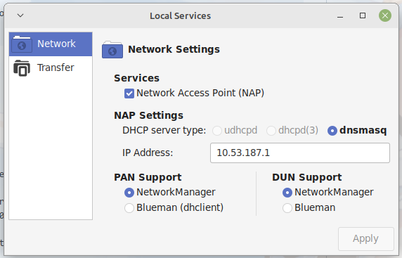
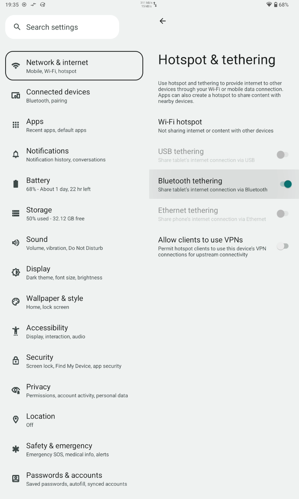

# ESP32 Bluetooth BNEP tether on ESP-IDF with BTstack

This example **will only** works on ESP32, thus other chips comes with no Classic BT support.

BNEP profile of Classic BT is capable to bridge link layer connection over Classic BT connection.

It is built on top of my fork of BTstack which brings component-manager support for dependencies management. Also another component named `esp-tapif` is required to support custom link layer implementation. Now ESP-IDF comes with another "l2tap" support but that is not what the tap interface is.

## HOWTO

Make sure your PC/Phone has BNEP configured.

On Linux Mint with blueman installed you can enable Network Access Point (NAP) service within blueman-applet:



On newer Android system (10+) there is option available:



And replace your BT MAC here `const char * remote_addr_string = "a4:6b:b6:3f:df:67";` in `bnep-tether.c`

Then simply:

```sh
idf.py flash monitor
```
